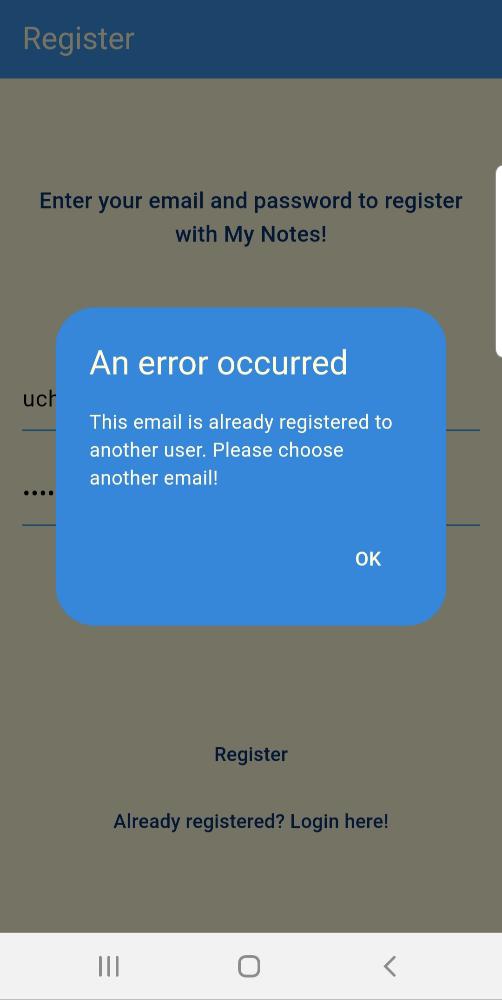

# Notetaker Mobile

A CRUD Application for users to create notes and store in a cloud based database  (Firebase). This application was built with modularity, allowing the backend database to easily be switched out. 

## Getting Started

Hello and thank you for taking a look at Notetaker Mobile. This is the codebase for this application, which was built with Flutter and Firebase. As of now, it is currently limited to Android OS devices. If you'd like to run / test this application for yourself, you will need:

- Android ADB 
- Microsoft Visual Studio Code
- Android Studio
- Flutter SDK

With these items, here is a quick summary of what to do:

1. Clone Repository
2. Open project in Microsoft Visual Studio Code
3. Connect Android phone via usb.
4. Input ctrl + shift + p on keyboard to display run commands
5. Type / Select "Flutter: Select Device"
6. Choose the name of your connected phone
7. In top left, go to Run --> Run Without Debugging
8. Application should then began compilation on mobile device 

For those that are interested in more information about the application, below is a feature list alongside some images to demonstrate:

## Feature List

- User Registration + User Email Verification

  

- User Account Log in (Home Screen)

- User Account Recovery (Forgotten Password)

 

- Note Creation + Note Editing + Note Deletion

    

- User Account Logout (top right corner)

 

- Error Dialogue Popups

Minor Detail List:

- Screen is scrollable while entering text into field
- Selected text field underline turns green when active
- Viewbox for notes is scrollable
- Notes contain deletion button with confirmation dialog
- Logout is contained in expandable item bar
- Custom Boot Up Screen 
- Custom App Thumbnail Image

 

Thank you for viewing this readme, message me with any questions/concerns!
